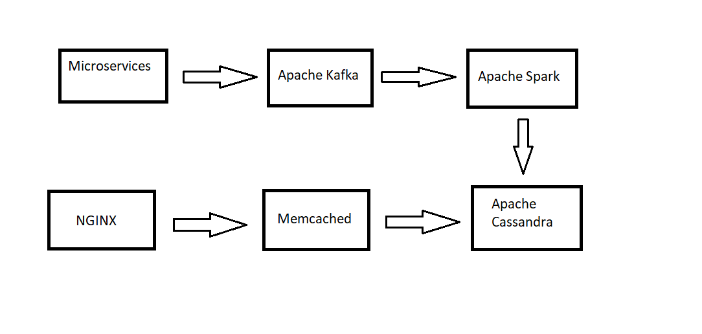

# 1. Immutable Queue
The code has been committed under src along with a test case class.

# 2. Analytics system design

## Design
To handle the requirements described, I propose the following design -

### Volume
The system needs to support billions of writes per day.

This means:
* average writes/sec = ~10 000 - 1 00 000/sec

For such high volume implementation, we can use system like [Apache Kafka](https://kafka.apache.org/ "Apache Kafka"). 

### Processing
For high volume data processing, a good stream processing layer will be needed like [Apache Spark](https://spark.apache.org/ "Apache Spark")

### DB
A NoSQL DB like [Apache Cassandra](https://cassandra.apache.org/ "Apache Cassandra") has been proven as the best choice for high volume data with minimum downtime.
 
### Client access
The clients can access the analytics through a web server like [NGINX](https://www.nginx.com/ "NGINX"). This server will fetch data from the db. Usage of cache will serve well here to reduce the network traffic like [Memcached](https://memcached.org/ "Memcached") 

## Other Design aspects
To make the design more reliable and acquire high performance, following aspects also needs to be focused in detail:

* DB partitioning
* divide the combination of data from various sources for parallel processing
